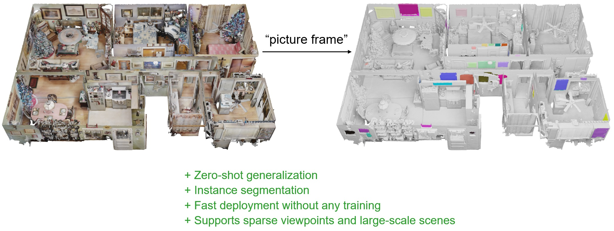
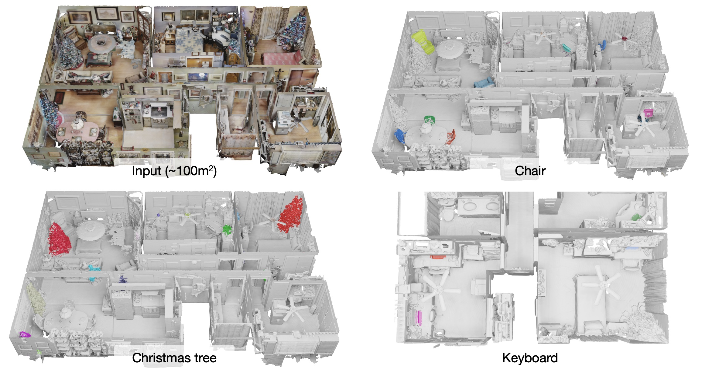
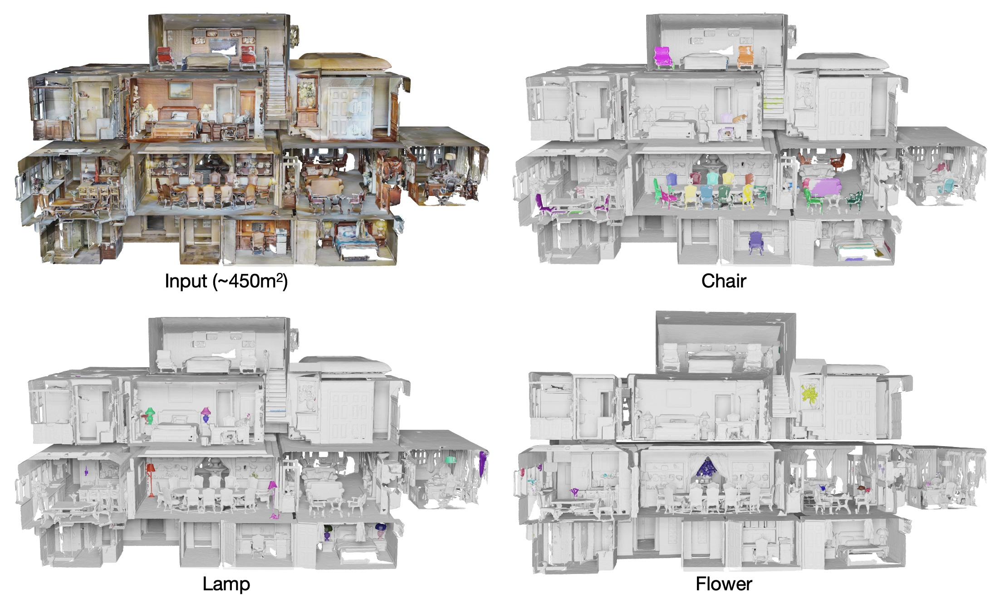
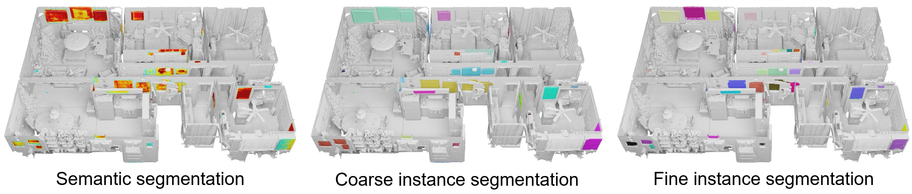

# AISeg3D: Segment Any Instance in 3D

- Authors: [Yingda Yin<sup>1</sup>](https://yd-yin.github.io/), [Yang Xiao<sup>2</sup>](https://youngxiao13.github.io/), [Jingwei Huang<sup>2</sup>](https://cs.stanford.edu/people/jingweih/), [He Wang<sup>1</sup>](https://hughw19.github.io/), [Baoquan Chen<sup>1</sup>](http://cfcs.pku.edu.cn/baoquan/)
- Institutes: <sup>1</sup>Peking University, <sup>2</sup>Huawei Riemann Lab
- Technical Report: TBD


*This project is still in progress. Any issues or pull requests are highly welcomed.*

## Introduction

We propose an approach for **open-vocabulary 3D instance segmentation**, leveraging the powerful 2D segmentation foundation models (e.g.,  SAM). Our method not only offers rapid deployment without additional training but also accommodates sparse viewpoints and large-scale scenes effectively.



Existing methods focused on distilling CLIP features into either point cloud or NeRF representations, which only yield semantic segmentation and necessitate training steps.

## Comparisons with related work

| Method             | Representation | Foundation<br />model | Open-<br />vocabulary | Instance<br />Segmentation | Sparse<br />viewpoints | Training-<br />free |
|--------------------|:--------------:|:---------------------:|:---------------------:|:--------------------------:|:----------------------:|:-------------------:|
| **DFF [1]**        |      NeRF      |         CLIP          |        &check;        |          &cross;           |        &cross;         |       &cross;       |
| **LERF [2]**       |      NeRF      |         CLIP          |        &check;        |          &cross;           |        &cross;         |       &cross;       |
| **SA3D [3]**       |      NeRF      |          SAM          |        &check;        |          &check;           |        &cross;         |       &check;       |
| **OpenScene [4]**  |  Point cloud   |         CLIP          |        &check;        |          &cross;           |        &check;         |       &cross;       |
| **SAM3D [5]**      |  Point cloud   |          SAM          |        &check;        |         auto-mask          |        &cross;         |       &check;       |
| **AISeg3D (Ours)** |  Point cloud   |     Grounded SAM      |        &check;        |          &check;           |        &check;         |       &check;       |


1. Kobayashi et al. "Decomposing NeRF for Editing via Feature Field Distillation." NeurIPS 2022
2. Kerr et al. "LERF: Language Embedded Radiance Fields." ArXiv 2303
3. Cen et al. "Segment Anything in 3D with NeRFs." ArXiv 2304
4. Peng et al. "OpenScene: 3D Scene Understanding with Open Vocabularies." CVPR 2023
5. Yang et al. "SAM3D: Segment Anything in 3D Scenes." ArXiv 2306


## Results





## Usage

### Installation

```bash
conda create -n aiseg python=3.8
conda activate aiseg
pip install torch==1.13.1+cu117 torchvision==0.14.1+cu117 torchaudio==0.13.1 --extra-index-url https://download.pytorch.org/whl/cu117
pip install open3d natsort
```

Install Grounded-Segment-Anything 

```bash
cd Grounded-Segment-Anything
export CUDA_HOME=/usr/local/cuda
python -m pip install -e segment_anything
python -m pip install -e GroundingDINO
```

Download pretrained models

```bash
cd Grounded-Segment-Anything
mkdir ckpt && cd ckpt
wget https://dl.fbaipublicfiles.com/segment_anything/sam_vit_h_4b8939.pth
wget https://github.com/IDEA-Research/GroundingDINO/releases/download/v0.1.0-alpha/groundingdino_swint_ogc.pth
```

### Data Preparation

We use Matterport3D dataset. 

For testing on our demo scene `RPmz2sHmrrY`, download data from [Google Drive](https://drive.google.com/file/d/1BRtP3UXMUjvq56AJQVHACtY3jNaiZRR2/view?usp=sharing) and unzip it to `data/matterport_2d`

```bash
mkdir -p data/matterport_2d
unzip RPmz2sHmrrY.zip
```

For all scenes in Matterport3D, download the pre-processed data offered by [OpenScene](https://pengsongyou.github.io/openscene).

```bash
cd data
wget https://cvg-data.inf.ethz.ch/openscene/data/matterport_processed/matterport_3d.zip
wget https://cvg-data.inf.ethz.ch/openscene/data/matterport_processed/matterport_2d.zip
unzip matterport_3d.zip matterport_2d.zip
```

### Get Started

1. **Preparation: Obtain 2D Grounded-SAM results**
   
   ```bash
   cd Grounded-Segment-Anything
   python run_gsam.py --text=TEXT --scene_id=SCENE_ID --thres=THRES_GSAM -g=GPU_ID 
   ```
   
   where `thres` controls the preservation of a box, i.e., boxes with similarities to `text` higher than `thres` are preserved.
   
   For example,
   
   ```bash
   cd Grounded-Segment-Anything
   python run_gsam.py --text="picture frame" --scene_id=RPmz2sHmrrY --thres=0.5 -g=0
   ```
   
   We set `save_dir=./data/matterport_2d/<scene_id>/results/<text>/` 
   
   The results will be stored at `save_dir/<text>_gsam<thres>/`
   
2. **Our method: 3D instance segmentation**
   
   ```bash
   python main.py --text="picture frame" --scene_id=SCENE_ID --thres_gsam=THRES_GSAM --thres_obj=THRES_OBJ --thres_connect=THRES_CONNECT
   ```
   
   where  `thres_gsam` should align with step1, `thres_obj` is used to determine the semantic of a point, and `thres_connect` is used to determine the connectivity of neighboring points. There is no need of GPU.
   
   For example,
   
   ```bash
   python main.py --text="picture frame" --scene_id=RPmz2sHmrrY --thres_gsam=0.5 --thres_obj=0.3 --thres_connect=0.8
   ```
   
   The results will be stored at `save_dir/points_objness_label_gsam<thres_gsam>_obj<thres_obj>_connect<thres_connect>.pts` in the format of `x y z objectness labelID`. We further filter out labels whose population are fewer than `<amount>`, saved in `save_dir/points_objness_label_gsam<thres_gsam>_obj<thres_obj>_connect<thres_connect>_amount<amount>.pts`

### Visualization

We assign random colors to each object label. 

```bash
python vis.py --text=TEXT --scene=SCENE_ID --pts_name=PTS_NAME
```

For example,

```bash
python vis.py --text="picture frame" --scene=RPmz2sHmrrY --pts_name=points_objness_label_gsam0.5_obj0.3_connect0.8_amount50.pts
```

We only provide mesh files of the demo scene considering license issues. If you want to get mesh visualizations of other scenes, please access via [Matterport3D website](https://niessner.github.io/Matterport/) and download `region_segmentations` to `./data/matterport_2d/<SCENE_ID>/`.

The colored point cloud will be stored at `save_dir/<pts_name>_color.pts`. The corresponding meshes will be stored at `save_dir/vis_mesh/`.

## Pipeline

1. Semantic segmentation
2. Instance segmentation
   1. **Coarse-level** segmentation by geometry distance
   2. **Fine-level** segmentation by 2D masks



## Acknowledgements

This project is inspired by [Segment Anything](https://segment-anything.com/), [Grounded Segment Anything](https://github.com/IDEA-Research/Grounded-Segment-Anything) and [OpenScene](https://pengsongyou.github.io/openscene).